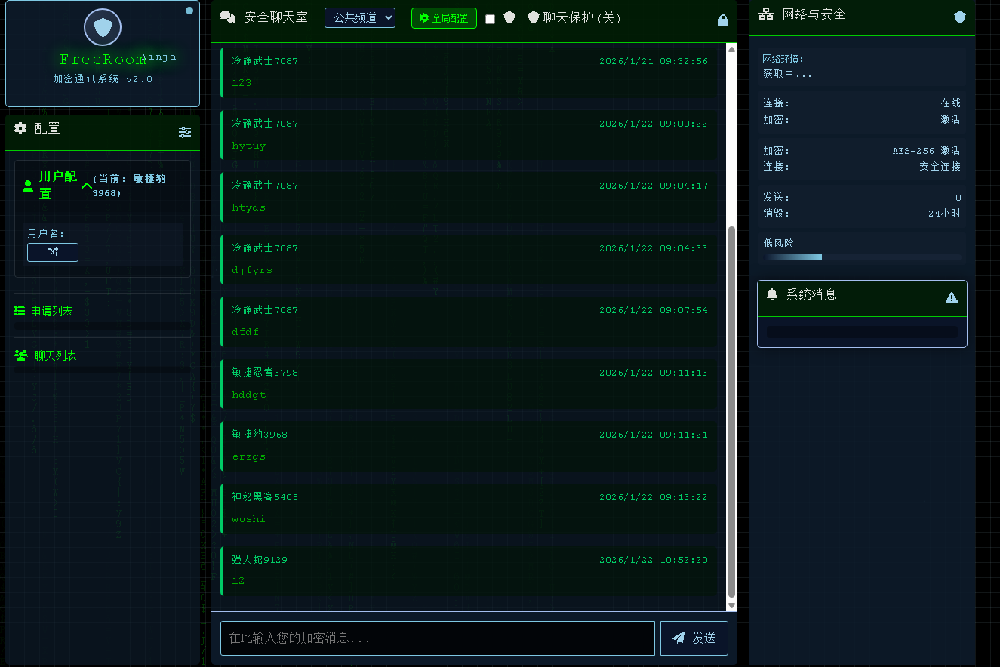
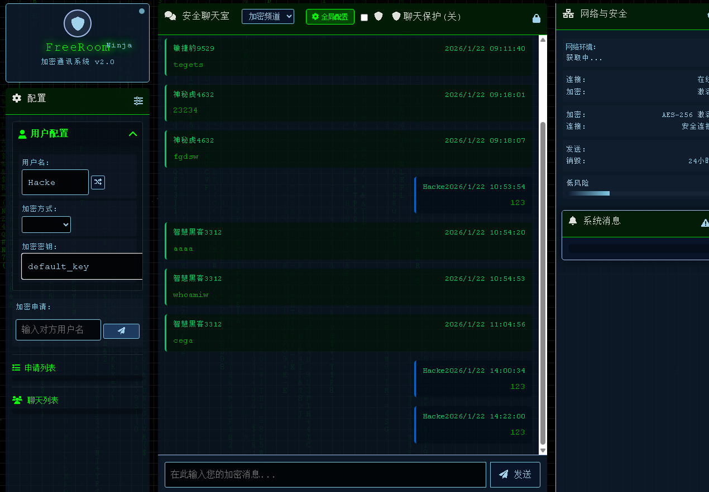

# FreeRoom - 安全加密聊天室

<p align="center">
  
  
  
  
</p>

## 🚀 项目概述

FreeRoom 是一个安全加密聊天室系统，旨在为用户提供高度隐私保护的实时通讯服务。系统采用端到端加密技术，确保用户之间的通信内容不会被第三方窃取或篡改。

## ⚠️ 项目状态

⚠️ **重要提醒：本项目的核心通信功能仍在开发中，尚未完全完成。**

当前版本包含以下已完成的功能：
- 加密请求系统
- 联系人管理
- 基础界面设计
- 部分API接口

但主要的实时消息通信功能尚未完全实现，因此项目目前还不适合生产使用。

## ✨ 主要特性

### 🔐 安全加密
- **AES-256加密**：使用高级加密标准保护消息内容
- **RSA加密**：用于密钥交换和身份验证
- **自定义加密算法**：额外的安全层保护
- **加密密钥管理**：用户可生成、管理和分享加密密钥

### 👥 联系人系统
- **加密请求**：用户可以发送加密聊天请求
- **双向验证**：接收方确认后建立加密连接
- **联系人列表**：管理加密聊天伙伴

### 💬 聊天功能
- **公共频道**：开放的消息交流区
- **私有频道**：仅限已建立加密连接的用户
- **消息历史**：保留最近的聊天记录
- **实时消息**：即时发送和接收消息

### 🔧 系统配置
- **多语言支持**：支持多种语言界面
- **主题切换**：深色/浅色模式可选
- **加密方法选择**：支持多种加密算法
- **用户配置管理**：个性化设置

### 🛡️ 安全防护
- **屏幕保护**：可锁定屏幕保护隐私
- **会话管理**：安全的用户会话处理
- **活动监控**：记录最后活动时间和系统运行时间

## 📷 项目截图

以下展示了 FreeRoom 聊天室系统的用户界面：

### 主界面


### 加密聊天界面


> **注意：** 以上截图展示了 FreeRoom 聊天室系统的用户界面，包括主界面和加密聊天功能。

## 🏗️ 技术架构

### 前端技术栈
- **HTML5/CSS3**：构建用户界面
- **JavaScript (ES6+)**：实现交互逻辑
- **Bootstrap 5**：响应式布局和组件
- **jQuery**：简化DOM操作

### 后端技术栈
- **PHP 7.x**：服务器端逻辑处理
- **MySQL**：数据存储和管理
- **PDO**：数据库连接和查询

### 数据库设计
- **messages表**：存储聊天消息
- **encryption_requests表**：管理加密请求
- **contact_keys表**：保存联系人密钥
- **sessions表**：管理用户会话

## 📁 项目结构

```
freeroom/
├── index.html              # 主页面
├── css/
│   └── chat.css           # 自定义样式
├── js/
│   ├── api.js             # API接口封装
│   ├── chat-core.js       # 核心聊天功能
│   ├── contact-manager.js # 联系人管理
│   ├── crypto-manager.js  # 加密功能管理
│   ├── config-manager.js  # 配置管理
│   ├── screen-protection.js # 屏幕保护功能
│   └── ...                # 其他功能模块
├── api/
│   ├── db_config.php      # 数据库配置
│   ├── send_message.php   # 发送消息接口
│   ├── get_messages.php   # 获取消息接口
│   ├── send_encryption_request.php # 发送加密请求
│   ├── get_pending_requests.php # 获取待处理请求
│   └── handle_encryption_request.php # 处理加密请求
├── init_db.php            # 数据库初始化脚本
└── init_encryption_db.php # 加密数据库初始化脚本
```

## 🚀 快速开始

### 环境要求
- Web服务器 (Apache/Nginx)
- PHP 7.x 或更高版本
- MySQL 5.7 或更高版本
- 支持JavaScript的现代浏览器

### 安装步骤

1. **克隆或下载项目**
   ```bash
   git clone https://github.com/your-username/freeroom.git
   ```

2. **配置Web服务器**
   - 将项目放置在Web服务器根目录
   - 确保PHP和MySQL已正确配置

3. **数据库初始化**
   - 修改 `api/db_config.php` 中的数据库连接信息
   - 访问 `init_db.php` 初始化数据库表结构
   - 访问 `init_encryption_db.php` 初始化加密相关表

4. **设置权限**
   - 确保Web服务器对必要文件有读写权限

5. **访问应用**
   - 在浏览器中访问 `index.html`
   - 开始使用安全加密聊天室

## 🤝 贡献指南

欢迎贡献代码和提出建议！请遵循以下步骤：

1. Fork 项目
2. 创建功能分支 (`git checkout -b feature/AmazingFeature`)
3. 提交更改 (`git commit -m 'Add some AmazingFeature'`)
4. 推送到分支 (`git push origin feature/AmazingFeature`)
5. 开启 Pull Request

## 📄 许可证

本项目采用 MIT 许可证 - 详情请参阅 [LICENSE](LICENSE) 文件

## 📞 支持

如果您有任何问题或建议，请通过 GitHub Issues 联系我们。

---

<div align="center">
  <p>✨ 感谢您使用 FreeRoom 安全聊天室系统 ✨</p>
  <p>享受安全、私密的通信体验</p>
</div>